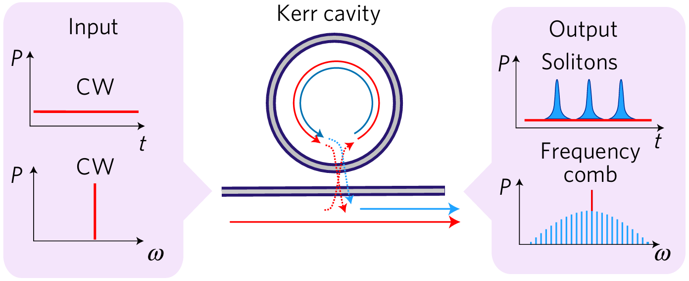

# Lugiato-Lefever Equation Solver

The Lugiato-Lefever Equation (LLE) was developed to provide a description of spatial dissipative structures in optical systems. It has been adopted to understand and predict Kerr-mediated nonlinear optical phenomena, such as parametric frequency comb generation within microresonators. 

In optical microresonators, Dissipative Kerr Solitons (DKS) are solutions to the Lugiato-Lefever equation where the cavity loss is balanced by a Continuous Wave (CW) laser and its associated parametric gain. DKS represent stable, self-reinforcing intracavity light patterns that enable fully coherent optical frequency combs, promoting their practical applications. Simulations based on the LLE formalism have allowed the creation of models that quantitatively agree with reported experimental results on DKS generation, such as multiple-soliton, single-soliton, and soliton crystal. 

<figure>
    
    <figcaption style="text-align:center;">
        The principle of microresonator frequency comb generation and the formation of DKS.
    </figcaption>
</figure>

The great potential of microresonator frequency combs in a wide variety of applications suggests the need for efficient and widely accesible computational tools to accelerate their development. Two different software implementations of a LLE solver for microcomb modeling are presented here, one using Python and the other using MATLAB®.

## Multiple-Soliton formation

The laser tuning technique was developed as an effective method for DKS formation, in which the CW pump laser is tuned over the cavity resonance from the effectively blue-detuned side to the red detuned side, called "forward tuning". When the pump is tuned further forward, it enters the effectively red-detuned regime where multiple intracavity solitons can form. 

## Soliton switching

Of particular interest are single-soliton states, which exhibit a spectrally smooth $𝑠𝑒ch^2$ envelope. However, these single-soliton states are rarely accessible with the forward tuning method. An additional laser tuning toward shorter wavelengths called "backward tuning" provides a way to reliably access the single-soliton state starting from an arbitrary multi-soliton state. The result of this backward tuning sequence allows successive extinction of solitons, also known as soliton switching, down to the single-soliton state.

## Soliton crystal formation

DKSs can form temporally ordered arrays known as soliton crystals. Their optical spectra are characterized by a set of strongly enhanced comb lines spaced by multiple Free Spectral Ranges (FSRs) that result from the equally spaced arrangement of DKS pulses in the microresonator. The formation of such structures is related to the presence of avoided mode crossings (AMXs), which through spectrally localized alterations of the microresonator dispersion change the optical spectrum of a DKS state and induce a modulation in the CW intracavity background, which leads to the ordering of DKS pulses in a crystal-like structure.

## References 

- https://doi.org/10.1038/nphys3893
- https://doi.org/10.5075/epfl-thesis-5877
- https://doi.org/10.1038/s41567-019-0635-0
- https://doi.org/10.1002/lpor.201600276
- https://doi.org/10.5281/zenodo.3726531